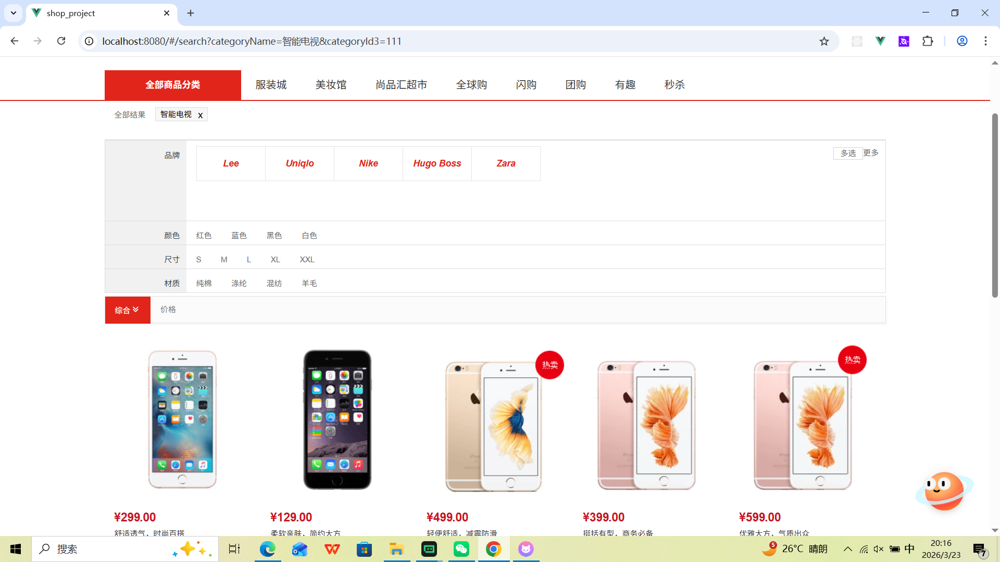
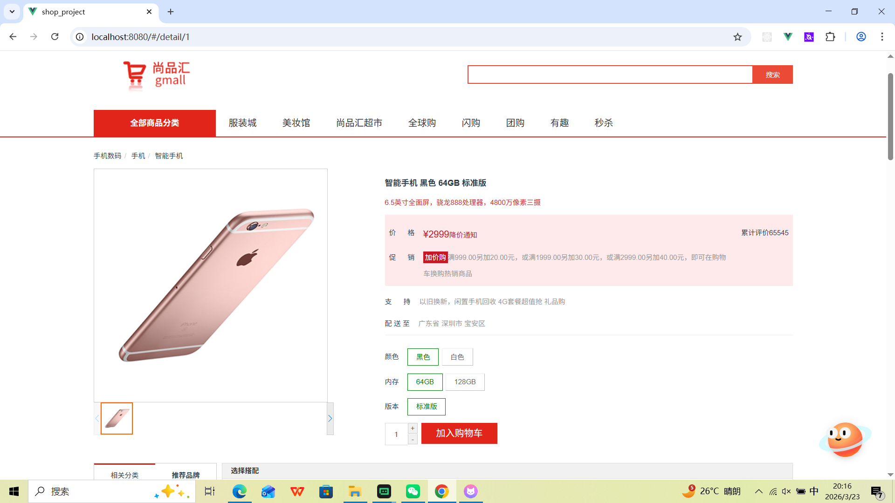
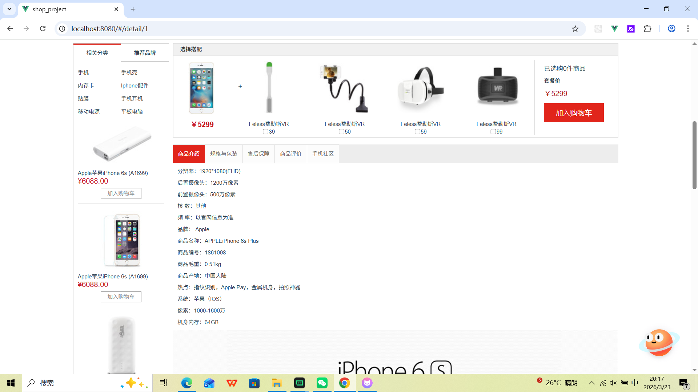
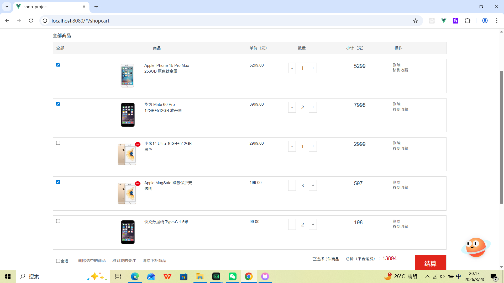

# shop_project
## Build Setup

```bash
# 克隆项目
git clone 

# 进入项目目录
cd shop_project

# 安装依赖
npm install

# 启动服务
npm run serve
```
### Lints and fixes files
```
npm run lint
```
### 首页

### 搜索


### 商品详情


### 购物车
